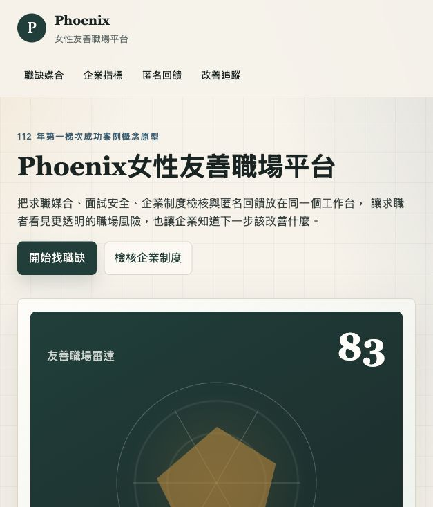
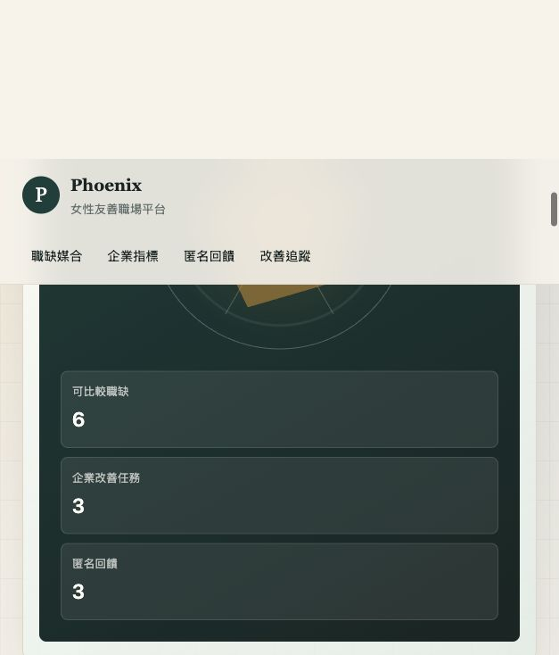

# Phoenix女性友善職場平台 demo repo

## 快速看懂

- 線上 Demo：https://atlasforcn.github.io/startup-phoenix-workplace/
- 這個原型在做什麼：把 Phoenix 做成女性友善職場評估、職缺媒合與改善追蹤平台。
- 特色定位：特色是同時服務求職者和企業，讓職場友善指標變成可比較、可改善的資料。
- 操作流程：篩選職缺並比較友善指標 → 送出匿名回饋或安全提醒 → 企業端追蹤制度檢核與改善任務

展開完整功能流程截圖

這是一個可直接用瀏覽器開啟的靜態互動原型，主題為「女性友善職場評估、職缺媒合與改善追蹤平台」。原型以求職者與人資雙邊使用情境設計，包含職缺篩選、企業友善指標、匿名回饋箱、福利/制度檢核、面試安全提醒、改善任務，以及收藏與比較功能。

## 比賽與案例來源

- 比賽來源：大專校院創新創業實戰模擬學習平臺
- 年度：112 年（2023）
- 屆次/階段：第一梯次成功案例
- 團隊/公司：Phoenix女性友善職場平台
- 學校：大同大學
- 類別：服務文創
- 作品名稱：Phoenix女性友善職場平台
- 官方來源：https://ssp.moe.gov.tw/cases/495

## 免責聲明

這是依公開得獎資訊與概念自行製作的興趣原型，不是原團隊官方 demo 或產品。

## 使用方式

直接以瀏覽器開啟 `index.html` 即可使用。此 demo 不需要安裝套件、不需要建置流程，也沒有外部依賴，適合放在 GitHub Pages。

## 原型功能

- 職缺篩選：依工作型態、城市、企業友善分數與制度標籤篩選。
- 求職收藏與比較：收藏職缺，將最多三個職缺加入比較表。
- 企業友善指標：檢視薪酬透明、申訴安全、育兒支持、彈性工作與夜歸保護等指標。
- 匿名回饋箱：提交匿名職場經驗，更新即時回饋列表。
- 福利/制度檢核：勾選企業現有制度，取得友善成熟度與改善建議。
- 面試安全提醒：依面試情境產生提醒清單並可保存。
- 改善任務：追蹤企業端制度改善任務與完成進度。

## 檔案結構

- `index.html`：主頁與可見來源資訊。
- `styles.css`：響應式版面與介面樣式。
- `app.js`：互動功能與 demo 資料。
- `SOURCE.md`：來源摘要與原型轉譯說明。
- `README.md`：專案說明。
